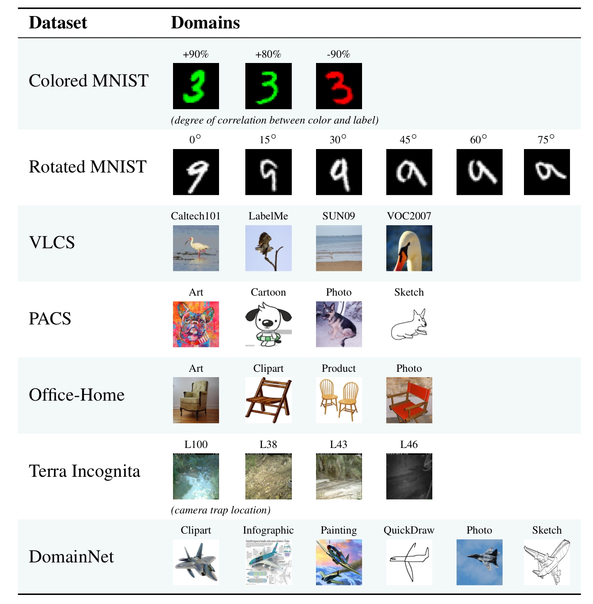

# Domain Generalization
!!! Note
    This is a note on domain generalization in order to prepare for entering statml research group.

## Introduction
Many applications do not fulfill the iid assumption and the machine learning systems often fail to generalize out-of-distribution in some scenarios such as self-driving car system, medical data etc. This motivates the development of a new area called **domain generalization**, which gets access to multiple datasets collected under different domains and incorporates the invariances into a classifier, and make the classifier have better out-of-distribution performance comparing with previous literatures.

## Domainbed
[A popular benchmark framework for domain generalization](https://github.com/facebookresearch/DomainBed).

### Data sets
There are several data sets available in Domainbed as listed in the following and more:

In the conditional offer problem I am required to do experiments on the PACS data sets, there are four domains: art, clipart, product, and photo respectively. So the experients are required to repeat four times by setting one of them as testing domain and the remaining three are training domains, this is also called leave-one-out.

### Baseline algorithms